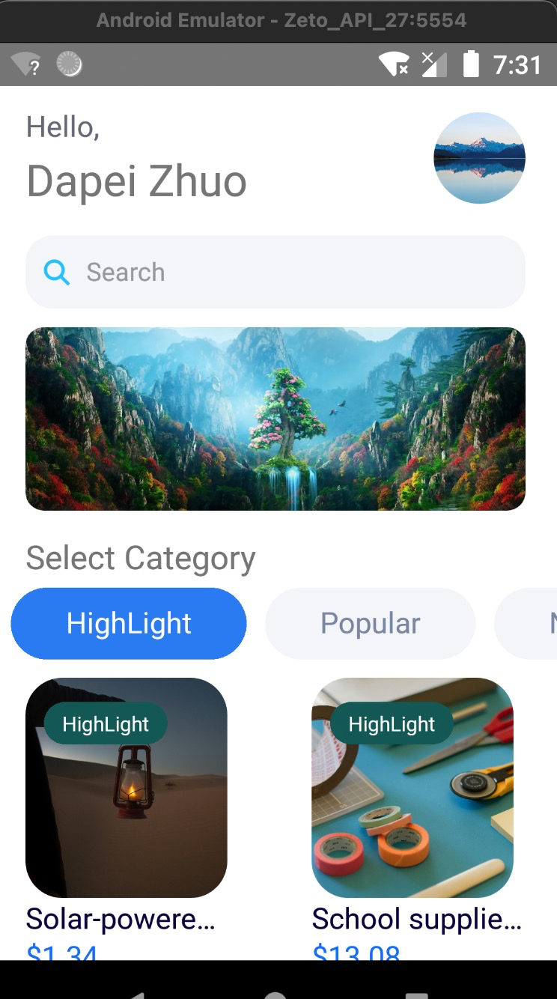
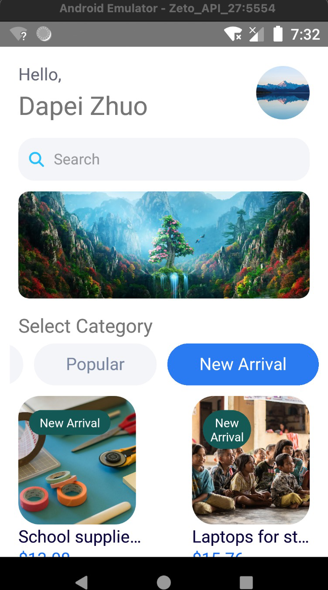
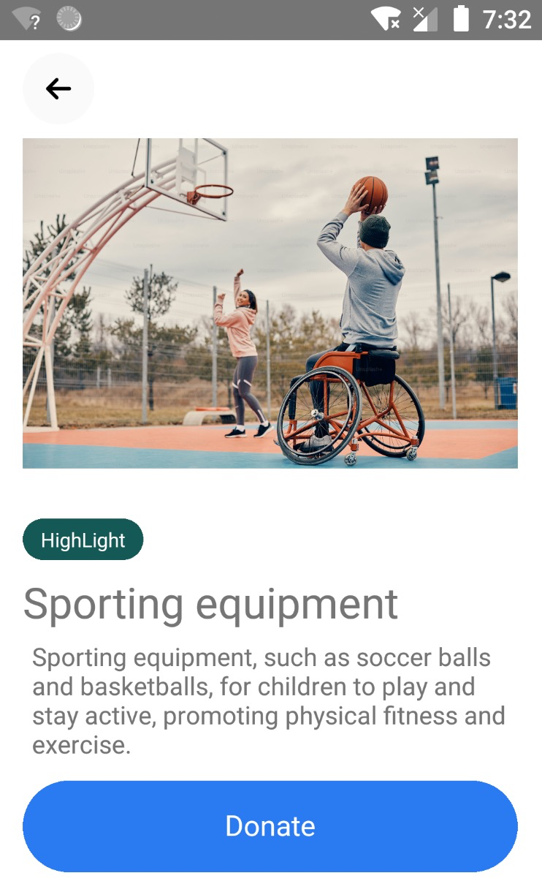
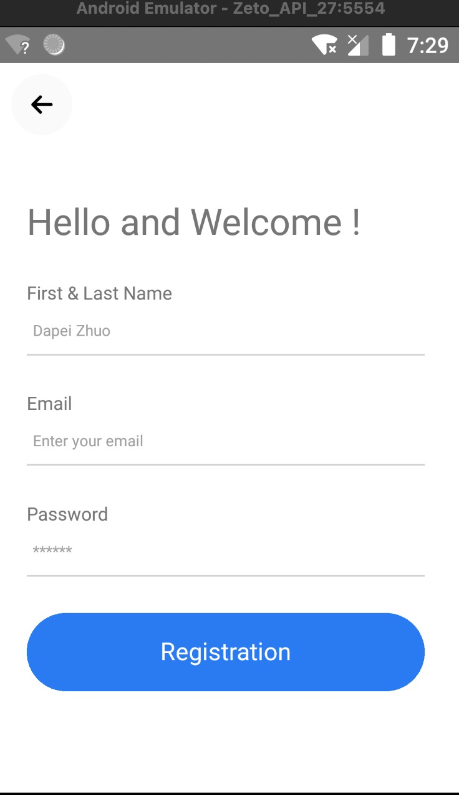
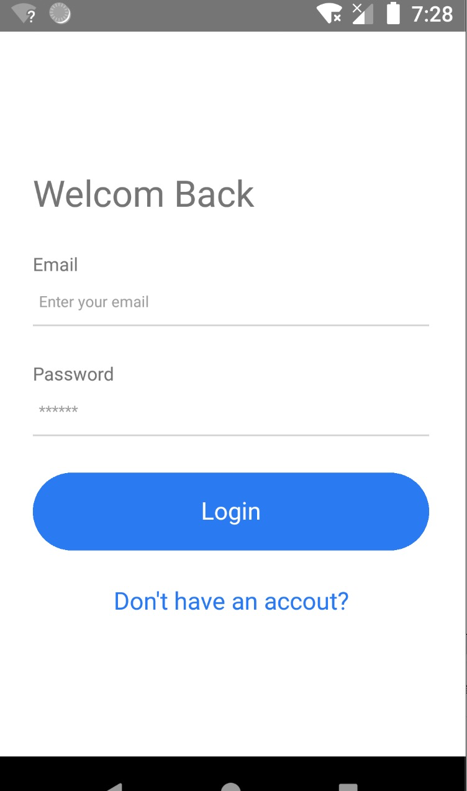

**## 仿 Instagram 主页和个人页 的 RN 实现**

# 项目简介

Udemy 中的 RN 教学课程的个人练习项目, 实现一个 **物品捐赠 APP**

React Native: Mobile App Development (CLI) [2024]

https://www.udemy.com/course/react-native-mobile-app-development/?couponCode=MTST7102224A2

##  课程完结证书

https://www.udemy.com/certificate/UC-2dfc5902-cd0e-4bde-ba3c-1cd6630d2c12/

这个项目设涉及许多知识的应用和实现.

包括但不限于:

- 搜索框
- 主页分类 tab 对应 grid 列表的数据联动
- 各种自定义 component 的封装
- 接入 Google Firebase 作为用户信息的服务端
- ...

# 效果展示:

## 主页1

 

## 主页2

## 捐赠详情页

## 注册页

## 登陆页 

